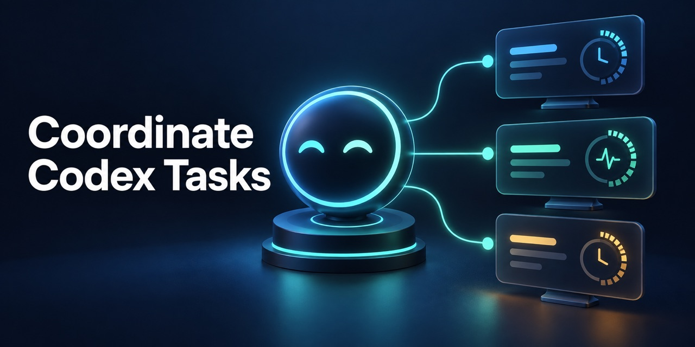

# Coordinate Codex Tasks



**讓原本的 Codex Task 委派工作給另一個 Task，同時保留協調、驗收與結案責任的 skill。** 每個受託 Task 對應一個專屬 heartbeat；主 Task 依實際進度更新指示，完成驗收或需要使用者決策時停用該排程。

[English](README.md) · [提示詞範例](docs/examples.zh-TW.md) · [Skill 指示](SKILL.md) · [驗證紀錄](docs/verification.md)

這是獨立的社群 skill，並非 OpenAI 官方產品。

## 能做什麼

- 只有使用者明確要求另開 Task 時，才建立新 Task。
- 區分「交給使用者自行追蹤的獨立 Task」與「由主 Task 交辦、仍需主 Task 整合驗收的 Task」。
- 對每個受託 Task 建立獨立監控排程；同一主 Task 可以有多個排程，但每個排程只追蹤一個受託 Task。
- 一般長任務從約 15 分鐘的間隔開始；沒有實質變化時保持安靜，不用密集排程增加干擾。
- 先讀受託 Task 和實際成果，再決定是否更新排程提示、交辦精確修正或停用。`idle` 或單一回合完成，不等於整項工作已完成。
- 由**主 Task**使用這個 skill；受託 Task 專心完成自己的工作，不需載入它來控制排程。

這是模型的工作指引，不是建立 Task 時必定執行的程式鉤子。定時執行仍取決於 Codex 排程工具及主機狀態；請參考[驗證範圍](docs/verification.md)。

## 使用條件

需要啟用 Codex Skills，並可使用 Codex app 的 Task 工具（`create_thread`、`wait_threads`、`read_thread`、`send_message_to_thread`）及 `automation_update`。另開 Task 必須已有使用者授權；一般內部分工應使用可用的子代理機制。

## 安裝

```sh
git clone https://github.com/easyvibecoding/coordinate-codex-tasks.git
mkdir -p "${CODEX_HOME:-$HOME/.codex}/skills/coordinate-codex-tasks"
cp coordinate-codex-tasks/SKILL.md "${CODEX_HOME:-$HOME/.codex}/skills/coordinate-codex-tasks/SKILL.md"
```

安裝後，在新的 Codex Task 中用一般語句要求另開 Task 即可讓模型依 skill 描述判斷是否選用；不必在提示詞寫出 skill 名稱。例如：

```text
請另開一個 Codex Task 實作 parser 修正。由目前這個 Task 負責整合與驗收，並追蹤新 Task 的進度。
```

Skill 是模型指引，並非每次建立 Task 都必定執行的鉤子。若新 Task 要由你自行追蹤，也請直接說明；這種情況不會建立主 Task 監控排程。

需要可直接改寫的委派、複數 Task、續接既有 Task 等用法，請看[提示詞範例](docs/examples.zh-TW.md)。

## 狀態處理

| 受託 Task 的證據 | 主 Task 的動作 |
| --- | --- |
| 執行中、沒有已驗證的新進度 | 排程維持啟用，不改提示、不發重複訊息。 |
| 新階段或可修復阻礙 | 只更新該 Task 的排程 checkpoint，必要時交辦一次精確修正。 |
| 閒置或回合已結束，但交辦工作未完成 | 讀取結果與實際成果；在授權範圍內續派同一 Task。 |
| 成果已驗收、終局阻礙或需要你決策 | 只停用該 Task 的排程，讀回並回報一次。 |

實際操作規範以 [SKILL.md](SKILL.md) 為準。

## 驗證與授權

本專案的檢查不需額外依賴：

```sh
python3 scripts/check.py
```

此檢查只驗證封裝與預覽圖，不保證模型在排程喚醒後的行為。[CONTRIBUTING.md](CONTRIBUTING.md) 說明變更要求。程式與圖像依 [MIT 授權](LICENSE) 發布；社群預覽圖由 Codex 生成。
